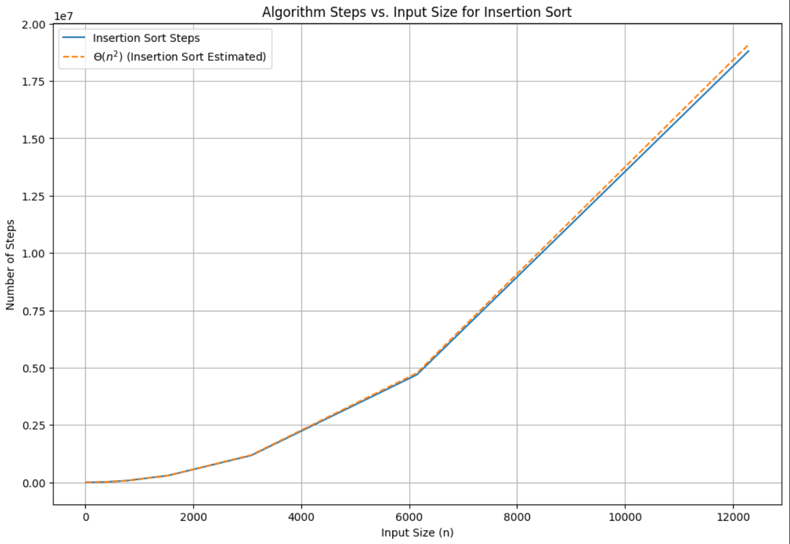

# DAT600: Algorithm Theory
**Martin, Erik : 250660**  
**Seim, Håvard : 260699**  
**Group: L**  

## Assignment – 1

| Algorithm      | Worst case | Average case / Expected case |
|----------------|------------|------------------------------|
| Insertion sort | $\Theta(n^2)$ | $\Theta(n^2)$ |
| Merge sort | $\Theta(nlgn)$ | $\Theta(nlgn)$ |
| Heapsort | $O(nlgn)$ | - |
| Quicksort | $\Theta(n^2)$ | $\Theta(nlgn)$ (expected) |

## 1. Programming
[code is here](#code)

### Step counting
Following the hint from the lecture, the insertion sort algorithm was modified to count the number of steps taken. For 

#### Insertion sort
The plots below with increasing input size shows that the number of steps taken is quadratic, as expected.
The expected time complexity is $\Theta(n^2)$. So the calculated number of steps taken for the plot is
$$
\frac{steps}{n^2} \text{ for each element in the list}
$$

For all the other algorithms, the number of steps taken is logarithmic. The expected time complexity is $\Theta(nlgn)$. So the calculated number of steps taken for the plot is
$$
\frac{steps}{n*log_2n} \text{ for each element in the list}
$$

This is how the estimated number of steps points are calculated in the plots.



#### Merge sort


#### Heapsort


#### Quicksort


## 2. Compare true execution time

After implementing the algorithms in Python and Go, we ran the algorithms on a list of 10 000 random integers. The results are shown in the table below. As expected, the Python implementations are a lot slower than the Go implementations. The results are also as expected in terms of the algorithms. Insertion sort is the slowest, followed by heapsort, quicksort, and merge sort.

<!--
py assignment1.py
Function insertion_sort, time elapsed: 1231119.752 us.
Function heapsort, time elapsed: 52052.732 us.
Function merge_sort, time elapsed: 20185.461 us.
Function quicksort, time elapsed: 37180.236 us.

go run ./go/assignment1.go
Function: insertionSort, Time elapsed: 11233 us.
Function: mergeSort, Time elapsed: 911 us.
Function: quickSort, Time elapsed: 614 us.
Function: heapSort, Time elapsed: 642 us.
-->

| Algorithm      | Time elapsed Python | Time elapsed Go |
|----------------|---------------------|-----------------|
| Insertion sort | 1231119.752 μs      | 11233 μs        |
| Merge sort     | 20185.461 μs        | 911 μs          |
| Heapsort       | 52052.732 μs        | 642 μs          |
| Quicksort      | 37180.236 μs        | 614 μs          |


## 3. Basic proofs
### a) Show that for any real constants a and b, where $b>0$, $(n + a)^b = Θ(n^b)$

If $(n+a)^b=\Theta(n^b)$, then constants $c_1, c_2, \text{ and } n_0$ exists such that $0 \leq c_1n^b \leq (n+a)^b \leq c_2n^b$ for all $n \lt n_0$

$$
\begin{align*}
\frac{c_1*n^b}{n^b} &\leq \frac{(n+a)^b}{n^b} \leq \frac{c_2*n^b}{n^b} \text{ for all } n \gt n_0 \\
c_1 &\leq \frac{(n+a)^b}{n^b} \leq c_2
\end{align*}
$$

For high values of n, the constant a is negligible, thus $\lim_{x\to\infty}\frac{(n+a)^b}{n^b} = \frac{n^b}{n^b}=1$. Since we know $\frac{(n+a)^b}{n^b}$ trends towards 1, we know there exists $c_1, c_2 \text{ and } n_0$ that fulfills $\Theta(n^b) = (n+a)^b$

### b) Show that $\frac{n^2}{lgn} = o(n^2)$
If $\frac{n^2}{lgn} = o(n^2)$, constants $n_0$ exist such that for any constant $c \gt 0, 0 \leq \frac{n^2}{lgn} \leq cn^2 \text{ for all } n \geq n_0$

In other terms, it holds true if $\lim_{n\to\infty}\frac{\frac{n^2}{lgn}}{n^2}=0$
$$
\lim_{n\to\infty}\frac{\frac{n^2}{lgn}*\frac{lgn}{n^2}}{n^2*\frac{lgn}{n^2}} = \lim_{n\to\infty}\frac{1}{lgn} = 0
$$

### c) Show that $n^2 \neq o(n^2)$

If $n^2 \neq o(n^2)$, it implies $n^2=\Omega(n^2)$

$0 \leq n^2 \leq cn^2$ with positive constant $c \lt 0$ and $n_0 \lt n$. 

We can already see that $c=1$ fulfills for all $n$

Because $0 \leq n^2 \leq n^2$


## 4. Divide and conquer
$$
T(n) = 3T(\frac{n}{2}) + \Theta(n)
$$

### Master theorem method
$$
T(n) = 3T(\frac{n}{2}) + \Theta(n)
$$
Master method 
The different cases are:
1. If $f(n) = O(n^{\log_b a - \epsilon})$ for some constant $\epsilon > 0$, then $T(n) = \Theta(n^{\log_b a})$.
   * Here, $a$, $b$ are constants in the recurrence $T(n) = aT(\frac{n}{b}) + f(n)$, and $\epsilon$ is a positive constant.
   
2. If $f(n) = \Theta(n^{\log_b a})$, then $T(n) = \Theta(n^{\log_b a} \log n)$.
   * This case applies when $f(n)$ grows at the same rate as $n^{\log_b a}$.

3. If $f(n) = \Omega(n^{\log_b a + \epsilon})$ for some constant $\epsilon > 0$, and if $a f(\frac{n}{b}) \leq c f(n)$ for some constant $c < 1$ and all sufficiently large $n$, then $T(n) = \Theta(f(n))$.
   * This case is used when $f(n)$ grows faster than $n^{\log_b a}$.


For our case:
$a = 3, b = 2, f(n) = \Theta(n)$  
We have the following  
* $n^{log_ba} = n^{log_23} \approx n^{1.58} \text{ since } log_23 \approx 1.58$
* $f(n) = \Theta(n^1)$ 

Since $1.58-1 \gt 0$ we can say that there exists a constant $\epsilon \gt 0$ such that $f(n) = O(n^{log_ba - \epsilon})$

Therefore we are in case 1.

This gives us:

$$T(n) = \Theta(n^{log_23})$$

### Recursion tree method
To use the visual method of the recursion tree we split the algorithm into a constant part and a recursive part. The constant part is $\Theta(n)$ which we set to $cn$ (where c is a positive constant), and the recursive part is $3T(\frac{n}{2})$. For each recursive call, tree branches out into three branches, each with a size of $\frac{n}{2^{level}}$ assuming the root node is level 0. The depth of the tree is $\log_2n$ since the size of the tree is halved for each level. The tree is shown [here](rec_tree.png). 

The totals calculated to the right of the tree are the sum of the nodes per level.

The last row of the tree will have $3^{log_2{n}} = n^{log_2{3}}$ subproblems of size $T(1)$, which yields $\Theta(n^{log_2{3}})$

The sums of each level are defined as $(3/2)^î*cn$

Taking the sum of each row gives the function: 

$$
\begin{align*}
T(n) &= \sum_{i=0}^{\log_2n-1} (3/2)^i*cn + \Theta(n^{log_2{3}})
\end{align*}
$$

The function tells us that $\Theta(n^{log_2{3}})$ overpowers the other part of the function as it is of higher order ($log_23 > 1$), so $T(n)=O(n^{log_{2}3})$ seems likely.

Testing $O(n^{log_{2}3})$:
We must show that $T(n) \le dn^{log_{2}3} $, d being a positive constant

$$
\begin{align*}
T(n) &&\le 3T(n/2)^{log_{2}3} + cn \\
T(n) &&\le 3d(n/2)^{log_{2}3} + cn \\
T(n) &&\le \frac{3dn^{log_{2}3}}{2^{log_{2}3}} + cn \\
T(n) &&\le dn^{log_{2}3} + cn
\end{align*}
$$

As shown above there is still $cn$, but due to $dn^{log_{2}3}$ being of higher order, cn will be overpowered for large enough n as $dn^{log_{2}3} + cn = O(n^{lo_g{2}3})$

This is the same result as the master theorem method.


## Code
Following the algorithms from *Introduction to Algorithms* we implemented the 
following algorithms in Python (and Go). The go code is mostly a 1:1 translation from the python code, with the exception of some list slicing.

### Python

#### Insertion sort
Derived from **INSERTION-SORT** pseudocode in *Introduction to Algorithms* p.18.
```python
def insertion_sort(items: list[int]) -> list[int]:
    """Simple insertion sort algorithm

    Args:
        items: list of ints to be sorted.

    Returns:
        items: list of ints sorted in ascending order.
    """
    for i in range(1, len(items)):
        val = items[i]
        j = i - 1
        while j >= 0 and items[j] > val:
            items[j + 1] = items[j]
            j -= 1
        items[j + 1] = val
    return items
```

#### Merge sort
Derived from **MERGE-SORT** p.34 and **MERGE** p.31 pseudocode in *Introduction to Algorithms*.
```python

def merge_sort(items: list[int], left: int, right: int) -> list[int]:
    """Merge sort algorithm.

    Args:
        items: List of items to sort.
        left: Left index of items.
        right: Right index of items.

    Returns:
        List of sorted items.
    """

    def merge(items: list[int], left: int, middle: int, right: int) -> list[int]:
        """Merges two sorted lists into one sorted list.

        Args:
            items: List of items to sort.
            left: Index of leftmost item.
            middle: Index of middle item.
            right: Index of rightmost item.

        Returns:
            Merged sorted list of items.
        """
        n1 = middle - left + 1
        n2 = right - middle
        L = [items[left + i] for i in range(n1)]
        R = [items[middle + i + 1] for i in range(n2)]
        i, j, k = 0, 0, left
        while i < n1 and j < n2:
            if L[i] <= R[j]:
                items[k] = L[i]
                i += 1
            else:
                items[k] = R[j]
                j += 1
            k += 1
        rest = L[i:] if i < n1 else R[j:]
        items[k : k + len(rest)] = rest

    if left < right:
        middle = (left + right) // 2

        merge_sort(items, left, middle)
        merge_sort(items, middle + 1, right)
        merge(items, left, middle, right)
```

#### Heapsort
Derived from **HEAPSORT** p.160, **MAX-HEAPIFY** p.154, and **BUILD-MAX-HEAP** p.157 pseudocode in *Introduction to Algorithms*.
```python
def heapsort(items: list[int]) -> list[int]:

    def max_heapify(items: list[int], heapsize: int, i: int) -> None:
        left = lambda: 2 * i + 1
        right = lambda: 2 * i + 2
        largest = i
        if left() < heapsize and items[left()] > items[i]:
            largest = left()
        else:
            largest = i

        if right() < heapsize and items[right()] > items[largest]:
            largest = right()

        if largest != i:
            items[i], items[largest] = items[largest], items[i]
            max_heapify(items, heapsize, largest)

    def build_max_heap(items: list[int], heapsize: int) -> None:
        for i in range(heapsize // 2 - 1, -1, -1):
            max_heapify(items, heapsize, i)

    build_max_heap(items, len(items))

    for i in range(len(items) - 1, 0, -1):
        items[i], items[0] = items[0], items[i]
        max_heapify(items, i, 0)
    return items

```

#### Quicksort
Derived from **QUICKSORT** and **PARTITION** pseudocode in *Introduction to Algorithms* p.171.
```python
def quicksort(items: list[int], left: int, right: int) -> None:
    def partition(items: list[int], left: int, right: int) -> int:
        x = items[right]
        i = left - 1
        for j in range(left, right):
            if items[j] <= x:
                i += 1
                items[i], items[j] = items[j], items[i]
        items[i + 1], items[right] = items[right], items[i + 1]
        return i + 1

    if left < right:
        split = partition(items, left, right)
        quicksort(items, left, split - 1)
        quicksort(items, split + 1, right)
```

### Go
```go
func insertionSort(items []int) {
	for i := 1; i < len(items); i++ {
		key := items[i]
		j := i - 1
		for j >= 0 && items[j] > key {
			items[j+1] = items[j]
			j--
		}
		items[j+1] = key
	}

}

func merge(items []int, left int, middle int, right int) {
	n1 := middle - left + 1
	n2 := right - middle
	L := make([]int, n1)
	R := make([]int, n2)
	for i := 0; i < n1; i++ {
		L[i] = items[left+i]
	}
	for j := 0; j < n2; j++ {
		R[j] = items[middle+j+1]
	}
	i, j, k := 0, 0, left
	for i < n1 && j < n2 {
		if L[i] <= R[j] {
			items[k] = L[i]
			i++
		} else {
			items[k] = R[j]
			j++
		}
		k++
	}
	if i < n1 {
		for i < n1 {
			items[k] = L[i]
			i++
			k++
		}
	} else {
		for j < n2 {
			items[k] = R[j]
			j++
			k++
		}
	}
}

func mergeSort(items []int, left int, right int) {
	if left < right {
		middle := (left + right) / 2
		mergeSort(items, left, middle)
		mergeSort(items, middle+1, right)
		merge(items, left, middle, right)
	}

}

func quickSort(items []int, left int, right int) {
	if left < right {
		split := partition(items, left, right)
		quickSort(items, left, split-1)
		quickSort(items, split+1, right)
	}
}
func partition(items []int, left int, right int) int {
	x := items[right]
	i := left - 1
	for j := left; j >= left && j < right; j++ {
		if items[j] <= x {
			i++
			items[i], items[j] = items[j], items[i]
		}
	}
	items[i+1], items[right] = items[right], items[i+1]
	return i + 1
}

func maxHeapify(items []int, heapsize int, i int) {
	left := func(i int) int {
		return 2*i + 1
	}
	right := func(i int) int {
		return 2*i + 2
	}
	largest := i
	if left(i) < heapsize && items[left(i)] > items[i] {
		largest = left(i)
	}
	if right(i) < heapsize && items[right(i)] > items[largest] {
		largest = right(i)
	}
	if largest != i {
		items[i], items[largest] = items[largest], items[i]
		maxHeapify(items, heapsize, largest)
	}
}

func buildMaxHeap(items []int, heapsize int) {
	for i := heapsize / 2; i >= 0; i-- {
		maxHeapify(items, heapsize, i)
	}
}

func heapSort(items []int) {
	buildMaxHeap(items, len(items))
	for i := len(items) - 1; i >= 0; i-- {
		items[i], items[0] = items[0], items[i]
		maxHeapify(items, i, 0)
	}
}
```